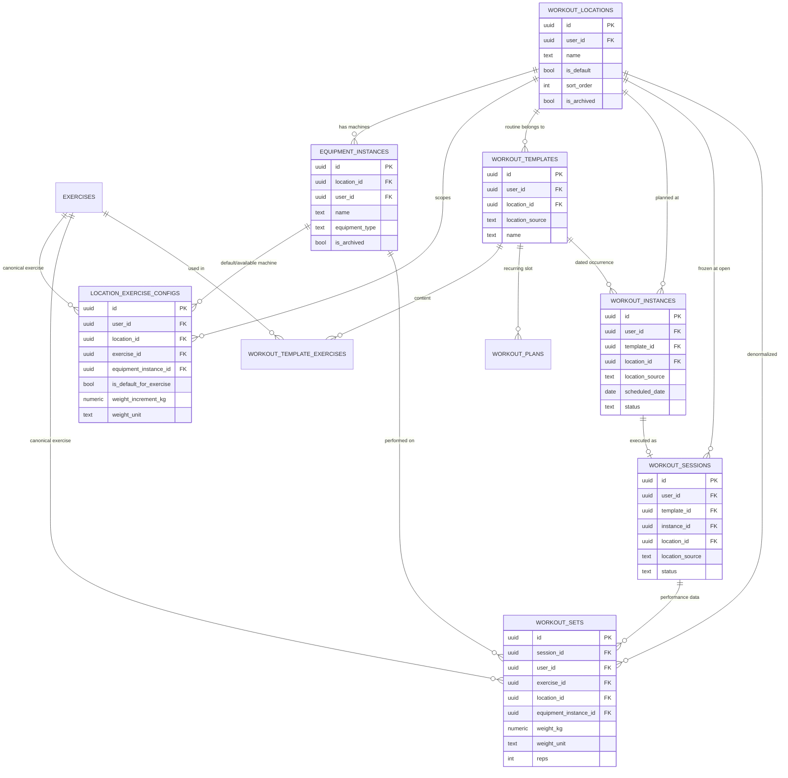

# Multi-Location Workout Architecture — Design Proposal (VIORA-MULTI-LOCATION-WORKOUT-ARCHITECTURE-001)

Status: **READY FOR APPROVAL** — design only. No migration has been run. No implementation PR has been opened.

Companion to `docs/adr/005-multi-location-workout-architecture.md` (read that first for the decision summary and rejected alternatives). This document carries the ten deliverables the sprint brief requested: full entity design, ER diagram, code impact map, migration proposal, wireflows, History/PR/Advisor rules, risks and edge cases, phased implementation plan, and expected file list.

---

## 1. Why the current model can't be trusted across gyms

Verified in the current schema and code (not assumed):

- `workout_sets` stores `exercise_id` + `weight_kg` with no location or machine reference at all.
- `exercise_equipment_profiles` / `exercise_insights` (added 2026-09-02, `supabase/migrations/20260902221740_create_exercise_insights.sql`) already model "a named equipment profile per exercise" — but scoped to `(user_id, exercise_id)` only. Two gyms both training "Chest Press" collide into the same profile today.
- `src/lib/exercise-stats.ts` → `computeExerciseStats` computes PRs, trend and averages from whatever `StatSet[]` it's handed.
- `src/lib/workout-session.ts` → `getLastPerformanceByExercise`, `getExercisePR`, `getExercisePRStats`, `getPriorPRs`, `detectPRs` all query `workout_sets` filtered by `user_id` + `exercise_id` only — no location dimension exists to filter on.
- `src/hooks/useExerciseIntel.ts` → `fetchIntel` does the same for the My Insights / exercise-detail dashboard.

So today, a heavier Chest Press set at Intel silently overwrites the "PR" and "recommended next weight" shown for the Icon Chest Press, because the query has no way to tell them apart. This is the exact defect the sprint requires fixed, and it is fixed by adding a location dimension to the data model, not by UI grouping.

`workout_instances` (dated planning occurrence) and its `plan_weekday` backfill heuristic already exist (`supabase/migrations/20260807062517_...sql`), confirming the codebase already accepted "backfill the identity that's missing, mark what's inferred, never guess what isn't recoverable" as a precedent — this proposal follows the same pattern for location.

---

## 2. Entities

### 2.1 `workout_locations` (new)

One row per physical (or virtual/temporary) place the user trains. User-owned, never shared across users, never auto-populated from a catalog.

| Column | Type | Notes |
|---|---|---|
| `id` | uuid PK | |
| `user_id` | uuid NOT NULL FK → `auth.users(id)` ON DELETE CASCADE | ownership |
| `name` | text NOT NULL | e.g. "אייקון שדרות", "אינטל", "בית", "מלון" |
| `is_default` | boolean NOT NULL DEFAULT false | unique partial index, one default per user |
| `sort_order` | integer NOT NULL DEFAULT 0 | user-controlled ordering |
| `is_archived` | boolean NOT NULL DEFAULT false | soft-hide, never delete |
| `archived_at` | timestamptz | |
| `notes` | text | |
| `created_at` / `updated_at` | timestamptz NOT NULL DEFAULT now() | `touch_updated_at()` trigger |

Constraints/indexes:
- `UNIQUE INDEX workout_locations_one_default_idx ON workout_locations(user_id) WHERE is_default`
- `UNIQUE INDEX workout_locations_id_user_idx ON workout_locations(id, user_id)` — enables the composite-FK ownership pattern used below (same technique as `exercise_equipment_profiles_identity_unique`).
- `INDEX workout_locations_user_active_idx ON workout_locations(user_id, is_archived, sort_order)`

RLS: standard own-rows-only `ALL` policy, `USING/WITH CHECK (auth.uid() = user_id)`, revoke-all-then-grant-to-authenticated pattern (matching `exercise_insights`, the newest/most hardened precedent in this repo).

### 2.2 `equipment_instances` (new)

A specific physical machine/rack/rig at one location. Deliberately **not** exercise-bound — one cable tower can serve several canonical exercises; the exercise link happens in `location_exercise_configs`.

| Column | Type | Notes |
|---|---|---|
| `id` | uuid PK | |
| `user_id` | uuid NOT NULL | denormalized owner, must match the owning location |
| `location_id` | uuid NOT NULL | FK, see composite constraint below |
| `name` | text NOT NULL | e.g. "Chest Press – Panatta", "Smith Machine" |
| `equipment_type` | text NULL | free text or small set (`plate_loaded`, `selectorized_stack`, `cable`, `barbell`, `dumbbell`, `bodyweight`, `other`); user-entered only, never invented |
| `brand` | text NULL | |
| `notes` | text NULL | |
| `is_archived` | boolean NOT NULL DEFAULT false | soft archive — sets keep referencing it |
| `created_at` / `updated_at` | timestamptz | |

Constraints:
- `UNIQUE (id, location_id, user_id)` — lets `location_exercise_configs` and `workout_sets` enforce "this instance really belongs to this location and this user" via composite FK, not just a bare `id` FK.
- `FOREIGN KEY (location_id, user_id) REFERENCES workout_locations(id, user_id) ON DELETE CASCADE` — an instance cannot outlive its location, and cannot be attached to a location owned by someone else.
- `INDEX equipment_instances_location_idx (location_id)`, `INDEX equipment_instances_user_active_idx (user_id, is_archived)`

RLS: same own-rows pattern (`auth.uid() = user_id`).

### 2.3 `location_exercise_configs` (new)

The join the sprint calls out explicitly: user + location + canonical exercise + local machine + local weight settings.

| Column | Type | Notes |
|---|---|---|
| `id` | uuid PK | |
| `user_id` | uuid NOT NULL | |
| `location_id` | uuid NOT NULL | FK `(location_id, user_id)` → `workout_locations(id, user_id)` |
| `exercise_id` | uuid NOT NULL FK → `exercises(id)` ON DELETE RESTRICT | the canonical, global exercise |
| `equipment_instance_id` | uuid NULL | FK `(equipment_instance_id, location_id, user_id)` → `equipment_instances(id, location_id, user_id)` ON DELETE SET NULL — nullable because some exercises at a location (e.g. bodyweight, a barbell lift) have no specific machine |
| `is_default_for_exercise` | boolean NOT NULL DEFAULT false | which machine is "the" one when a location has more than one option for the same exercise |
| `weight_increment_kg` | numeric NULL | e.g. 5 for a plate-loaded stack, 4.5 for a selectorized one |
| `weight_unit` | text NOT NULL DEFAULT 'kg' CHECK IN ('kg','lb') | |
| `notes` | text NULL | |
| `created_at` / `updated_at` | timestamptz | |

Constraints:
- `UNIQUE INDEX ..._with_instance_idx ON (user_id, location_id, exercise_id, equipment_instance_id) WHERE equipment_instance_id IS NOT NULL`
- `UNIQUE INDEX ..._no_instance_idx ON (user_id, location_id, exercise_id) WHERE equipment_instance_id IS NULL` — the same NULL-uniqueness technique `exercise_insights` already uses for its general/profile-scoped split.
- `UNIQUE INDEX ..._one_default_idx ON (user_id, location_id, exercise_id) WHERE is_default_for_exercise`

RLS: own-rows pattern.

Row lifecycle: deleting a config never deletes history — `workout_sets` carries its own denormalized `location_id`/`equipment_instance_id`/`exercise_id`, so historical sets survive a config or even an equipment instance being archived or deleted.

### 2.4 `routines` (existing `workout_templates`) — add `location_id`

`workout_templates` is the table the app's own code already calls "reusable routines" (`src/routes/_authenticated/workout-templates.tsx`).

- `ADD COLUMN location_id uuid NULL REFERENCES workout_locations(id) ON DELETE SET NULL`
- `ADD COLUMN location_source text NOT NULL DEFAULT 'unknown' CHECK (location_source IN ('user_selected','migration_default','unknown'))`

Nullable at the DB level permanently (see §5); the application enforces "must pick a location" for every *newly created* routine once the location UI ships, and offers reconciliation for existing ones. `workout_plans` (the weekday recurring slot) is **not** given its own `location_id` — it inherits the location through `workout_plans.template_id → workout_templates.location_id`, avoiding a second source of truth for the same fact.

### 2.5 `workout_sessions` — add `location_id` (frozen at open)

- `ADD COLUMN location_id uuid NULL REFERENCES workout_locations(id) ON DELETE SET NULL`
- `ADD COLUMN location_source text NOT NULL DEFAULT 'unknown' CHECK (...)` — same three states.
- A `BEFORE UPDATE` trigger (`workout_sessions_lock_location`) rejects any change to `location_id` once at least one row in `workout_sets` references this session — i.e. the location is freely correctable up until the athlete logs their first set, then frozen for the rest of the session's life. This satisfies "Workout Session חייב לשמור location_id קבוע בזמן פתיחת האימון" while still tolerating a mis-tap before real data exists.

`workout_instances` gets the same nullable `location_id` (+ `location_source`) so location-grouped planning views can query instances directly without joining through sessions; it is populated from the routine's `location_id` when an instance is created from a routine, or from the session's chosen location for an ad-hoc/empty workout.

### 2.6 `workout_sets` — add `location_id`, `equipment_instance_id`, `weight_unit`

- `ADD COLUMN location_id uuid NULL REFERENCES workout_locations(id) ON DELETE SET NULL` — denormalized from the parent session at insert time, so PR/recommendation queries never need to join `workout_sessions`.
- `ADD COLUMN equipment_instance_id uuid NULL` — FK `(equipment_instance_id, location_id, user_id)` → `equipment_instances(id, location_id, user_id)` ON DELETE SET NULL — nullable, "כאשר רלוונטי".
- `ADD COLUMN weight_unit text NOT NULL DEFAULT 'kg' CHECK (weight_unit IN ('kg','lb'))`
- A `BEFORE INSERT/UPDATE` trigger copies `location_id` from the parent `workout_sessions` row when the caller omits it, and raises if a caller supplies a `location_id` that disagrees with the session's — the set's location is never independently choosable, only inherited and locked.

New index for the query pattern every PR/last-weight/recommendation lookup now needs:

```sql
CREATE INDEX workout_sets_user_exercise_location_instance_idx
  ON workout_sets (user_id, exercise_id, location_id, equipment_instance_id, completed_at DESC);
```

The existing `(user_id, exercise_id)` index is kept — it still serves the "all locations, overall summary" rollup view in My Insights (§6).

### 2.7 Reconciling `exercise_equipment_profiles` / `exercise_insights`

These tables (migration `20260902221740`) already model "a named equipment profile" and "a note tied to that profile," but with no location concept — they predate this sprint by one day and, as far as this review can tell, carry no production rows yet. Recommendation:

- Keep both tables and their existing RLS/constraints untouched (no destructive change; if rows do exist, they survive as-is).
- `equipment_instances` becomes the location-aware successor for *machine identity*. A follow-up (separately approved, not part of this design-only sprint) can offer to let a user "promote" an `exercise_equipment_profiles` row into a real `equipment_instances` row at a chosen location, preserving the original row.
- `exercise_insights.category = 'working_weight'` (free-text) is superseded in meaning by the structured `location_exercise_configs.weight_increment_kg` / `weight_unit`, but the column, its rows, and its category value are never dropped — only new UI stops writing new `working_weight` text rows once the structured fields exist, per ADR house rule of soft-deprecation over deletion.

---

## 3. ER Diagram



---

## 4. Referential integrity, ownership, RLS summary

| Table | Ownership | Delete behavior on parent removal | RLS |
|---|---|---|---|
| `workout_locations` | `user_id` direct | n/a (top of the chain; only removed via account cascade) | own-rows `ALL` |
| `equipment_instances` | `user_id` + composite FK to location's `(id,user_id)` | `ON DELETE CASCADE` from location (app never hard-deletes locations, only archives) | own-rows `ALL` |
| `location_exercise_configs` | `user_id` + composite FKs to location and instance | location: CASCADE; exercise: RESTRICT; instance: SET NULL | own-rows `ALL` |
| `workout_templates.location_id` | via existing template ownership | `SET NULL` — archiving a location never deletes a routine | unchanged |
| `workout_instances.location_id` | via existing instance ownership | `SET NULL` | unchanged |
| `workout_sessions.location_id` | via existing session ownership | `SET NULL`; locked by trigger once sets exist | unchanged |
| `workout_sets.location_id` / `equipment_instance_id` | via existing set ownership | `SET NULL` | unchanged |

Every new table follows the `exercise_insights` migration's hardened grant pattern: `REVOKE ALL FROM public, anon, authenticated` first, then explicit `GRANT SELECT, INSERT, UPDATE, DELETE TO authenticated` and `GRANT ALL TO service_role`, policies using `(select auth.uid()) = user_id` for both `USING` and `WITH CHECK`.

**No plan, session, or set is ever deleted or overwritten by this design.** Every location-removal path is `SET NULL`/archive, never `CASCADE` onto performance history.

---

## 5. Migration strategy (design only — not executed this sprint)

### Phase M1 — additive schema (safe, reversible, no data loss)

1. Create `workout_locations`, `equipment_instances`, `location_exercise_configs` (empty on creation).
2. Add nullable `location_id` + `location_source` (`DEFAULT 'unknown'`) to `workout_templates`, `workout_instances`, `workout_sessions`.
3. Add nullable `location_id`, `equipment_instance_id`, `weight_unit` (`DEFAULT 'kg'`) to `workout_sets`.
4. Add the trigger locking `workout_sessions.location_id` after first set, and the trigger propagating/validating `workout_sets.location_id` against its session.
5. Add the new composite index on `workout_sets`.

Every one of these steps is additive: existing reads/writes keep working unchanged because every new column is nullable with a safe default and no existing column is altered or dropped. This phase alone can ship with zero user-facing change and zero UI.

### Phase M2 — guided reconciliation (separate, user-facing sprint)

- A "Set up your training locations" onboarding step: user creates real locations (אייקון שדרות, אינטל, ...) and marks one default.
- A one-time reconciliation action, per the sprint's explicit requirement, offers: *"Assign all routines/sessions with no location to: [pick one]"* — a single confirmed bulk action that sets `location_id` + `location_source = 'migration_default'` only on rows the user explicitly includes. The user may instead leave any subset as permanently "Unknown" (`location_source = 'unknown'`, `location_id NULL`), or reassign individual routines one at a time (`location_source = 'user_selected'`).
- **At no point does the system infer a location from `started_at`, template name, weekday, or any other heuristic.** This is the one hard line from the sprint brief this design never crosses, even though `workout_instances`' own migration (`20260807062517`) did use a heuristic — that precedent was for *linking a session to its own already-known weekly slot*, not for inventing a location that was never recorded anywhere.

### Phase M3 — tightening (future, conditional)

- Once reconciliation coverage is high (dashboard shows near-zero `location_source = 'unknown'` rows the user cares about), the application layer requires `location_id` for all *new* routines/sessions/sets going forward (already true from M2 onward). A DB-level `NOT NULL` is likely never fully achievable without either deleting legacy rows or forcing every historical row into a bucket the user didn't actually choose — so this phase, if pursued at all, is scoped to new-row enforcement only, documented as an accepted permanent nullability at the schema level.

---

## 6. UX rules — History, PR and Advisor by location

1. **Workouts screen**: locations render as collapsible groups (Hevy-style), each showing only its own routines. Default-location group expanded by default; archived locations hidden entirely (still queryable from history, never deleted).
2. **Starting a routine from inside a location group** auto-selects that location for the new session — no prompt.
3. **Starting an empty/ad-hoc workout** prompts for a location, pre-checking the user's default; the chosen location is shown clearly before the first set is logged (per session-open freeze in §2.5).
4. **Switching locations mid-browse** (not mid-session) swaps: available routines, equipment list, last-weights, recommendations, and machine-dependent PRs — never touches stored history.
5. **My Insights**: shows per-location detail plus an overall summary only where the comparison is valid (e.g. total sessions, total volume trend across all locations is a legitimate rollup; "PR" is not — a rollup PR view is explicitly labeled "best across all locations" and links back to which location/machine set it, never presented as a same-machine progression).
6. **Advisor ("Daniel" training persona)**: the context bridge (`src/lib/advisor-core/server/advisor-context-bridge.server.ts`) must read the active session's `location_id` (and `equipment_instance_id` where a set is being discussed) alongside the training facts it already selects per ADR 003, and pass it through so weight guidance is scoped the same way the UI is.
7. **Recommendation order**: same exercise + same location + same equipment instance first; if no local history exists, the user sees "no history at this machine yet — starting fresh," never a value silently carried over from another location. Copying a starting point from another location is only ever a user-initiated, explicit action ("copy my Intel Chest Press weight as a starting point here?"), never automatic.

---

## 7. Wireflows

Five screens, described as flows (a companion visual wireframe artifact accompanies this document for the same five screens):

1. **Location list** (`/workouts`, top of the tree) → collapsible group per location (name, routine count, default badge) → tap header to collapse/expand (persisted per-user) → "+ Add location" row at the bottom → long-press/kebab per location for rename / set-default / reorder (drag handle) / hide.
2. **Routines by location** → tapping a location group expands to its routines only (existing routine cards, unchanged visual language) → routines belonging to no location (`unknown`) surface in a distinct "לא משויך למיקום" group at the bottom, never mixed silently into a real location's list.
3. **Create location** → sheet: name (required), "make default" toggle, save → returns to Location list with the new group expanded and empty.
4. **Choose location before workout** (empty/ad-hoc start only) → sheet: radio list of active locations, default pre-checked, "manage locations" escape hatch → confirm → session opens with that `location_id` frozen.
5. **Manage local equipment** (from inside a location's settings) → list of that location's `equipment_instances` (name, type, archived toggle) → "+ Add machine" → per-machine detail shows which exercises/configs reference it and its local PR, never another location's.

---

## 8. Risks and edge cases

- **Same routine used at two locations ("home" and "hotel" both do the same bodyweight circuit).** Handled by "duplicate to another location" (sprint UX requirement #2) rather than one routine belonging to two locations — a routine's location is singular by design; duplication keeps configs and history unambiguous per copy.
- **A user trains the same exercise at a location with no `equipment_instances` set up yet (e.g. bodyweight, barbell squat with plates they don't bother naming).** `equipment_instance_id` is nullable throughout the chain specifically for this; location-only scoping still separates the history correctly even with no named machine.
- **Temporary/one-off locations ("מלון", a business trip).** No special-cased entity — just another `workout_locations` row; "hide" (soft archive) rather than delete keeps its handful of sessions intact and out of the default view.
- **A session started at one location is finished at another (rare, e.g. app was backgrounded and phone location isn't actually tracked — this is a *training* location the user selects, not GPS).** The freeze-after-first-set trigger accepts this as a known limitation: the user picks wrong before their first set, they can fix it right up until they log one; after that, it's an explicit "edit session" action post-hoc (out of scope for this sprint; flagged as an open decision below), never silent.
- **Migration reconciliation abandoned halfway (user assigns 3 of 10 old routines, leaves the rest "unknown" forever).** Explicitly allowed — `unknown` is a permanent, first-class, non-blocking state, not a required intermediate step.
- **Two equipment instances at one location legitimately serve the same exercise** (two Chest Press units, old and new). `location_exercise_configs` supports multiple rows per `(location, exercise)` with one flagged `is_default_for_exercise`; PR/recommendation defaults to that row but per-set history still tags whichever instance was actually used.
- **Advisor mixing locations in a single conversation** ("how's my chest press going") — the persona must state which location/machine it's answering about when more than one has history, rather than silently blending them; this is a prompt/config change to the training persona's rules (ADR 003 territory), tracked as follow-up, not solved by schema alone.

## Open decisions (flagged for Super Agent / product sign-off, not resolved here)

- Whether post-first-set location correction on a session should ever be allowed (edit-history action) or stay permanently locked once set.
- Whether `equipment_type` becomes a constrained enum later or stays free text indefinitely.
- Exact wording/flow for the advisor's cross-location disclosure (UX copy, not schema).

---

## 9. Phased implementation plan (future sprints — not started)

1. **Schema (Phase M1 above)** — tables, columns, triggers, indexes, RLS. No UI. No behavior change.
2. **Location management UI** — create/rename/reorder/default/hide; empty state (no locations yet ⇒ prompt to create the first one, not blocking existing workflows).
3. **Routine ↔ location** — assignment on create/edit, "move or copy to another location" actions, the "unassigned" group in the routines list.
4. **Session-open location selection** — auto-select from routine's location; explicit picker for ad-hoc starts; freeze-after-first-set trigger wired to the UI (disable the location field once locked).
5. **Equipment instances + location_exercise_configs UI** — manage machines per location; link exercises to a default machine.
6. **Query layer migration** — `getLastPerformanceByExercise`, `getExercisePR`, `getExercisePRStats`, `getPriorPRs`, `detectPRs`, `useExerciseIntel.fetchIntel` all gain `locationId`/`equipmentInstanceId` parameters and filter accordingly; overall-rollup variants added alongside, not instead of, the location-scoped ones.
7. **My Insights + Advisor bridge** — per-location views, the labeled cross-location summary, and the context-bridge location field for "Daniel."
8. **Reconciliation wizard (Phase M2)** — explicit, user-driven, bulk-or-nothing, no heuristics.

---

## 10. Expected files to change (future implementation sprints)

**New migrations** (additive only, per §5):
- `supabase/migrations/*_create_workout_locations.sql`
- `supabase/migrations/*_create_equipment_instances.sql`
- `supabase/migrations/*_create_location_exercise_configs.sql`
- `supabase/migrations/*_add_location_to_templates_instances_sessions_sets.sql`

**Data layer:**
- `src/lib/workout-session.ts` — `getLastPerformanceByExercise`, `getExercisePR`, `getExercisePRStats`, `getPriorPRs`, `detectPRs`, `createSessionFromTemplate`, `startOrResumeSessionForTemplate`, `insertPlannedSet`, `getWeeklyPlan`/`setPlanSlot` (location on templates/plans)
- `src/lib/workout-instance.ts` — instance creation/resolution gains `location_id`
- `src/lib/exercise-stats.ts` — `computeExerciseStats`/`smartBadges` accept location-scoped vs. rollup input, unchanged math otherwise
- `src/lib/workout-occurrence.ts` — location-aware matching where it currently reads instances/sessions
- New: `src/lib/workout-locations.ts`, `src/lib/equipment-instances.ts`, `src/lib/location-exercise-configs.ts`

**Hooks/services:**
- `src/hooks/useExerciseIntel.ts`
- `src/services/recommendations.service.ts`, `src/services/index.ts`
- `src/lib/intelligence.ts`

**Advisor:**
- `src/lib/advisor-core/server/advisor-context-bridge.server.ts`
- `src/lib/advisor-core/configs.ts` / `shared-rules.ts` / `safety-rules.ts` (Daniel persona cross-location disclosure copy)

**Routes/UI:**
- `src/routes/_authenticated/workouts.index.tsx` (location groups)
- `src/routes/_authenticated/workouts.program.tsx`, `workout-templates.tsx` (location assignment, move/copy)
- `src/routes/_authenticated/workouts.session.$sessionId.tsx` / `.index.tsx` (location picker, freeze indicator)
- `src/components/workouts/ExerciseDetailsSheet.tsx`, `AssignDayDialog.tsx`, `PlannerDayCard.tsx`
- `src/components/dashboard/SmartRecommendations.tsx`
- New components: location list/group, create-location sheet, choose-location-before-workout sheet, manage-equipment screen

**Types:**
- `src/integrations/supabase/types.ts` (regenerated), `src/types/index.ts`

**Explicitly untouched, per hard constraint:** Exercise Media Dashboard and its pipeline (`exercise-media-v2*`, media lifecycle migrations), the canonical `exercises` table and its global sharing model, `docs/adr/004-exercise-asset-pipeline-v2.md` territory.

---

## Handoff

🏗️ Viora Software Architect / Claude Code → 🧠 Viora Super Agent for architecture review and implementation approval.

**FINAL STATUS: VIORA_MULTI_LOCATION_WORKOUT_ARCHITECTURE_READY_FOR_APPROVAL**
